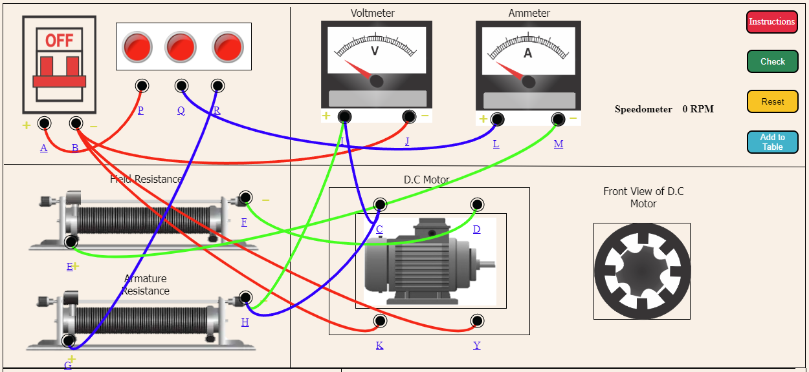

<b>STEP 1:</b> Make connections as per the instructions given below: 

<table style="text-align: center;">
<tr>
                    <td style="border:1px solid black;"><b>From</b></td>
                    <td style="border:1px solid black;">A</td>
                    <td style="border:1px solid black;">B</td>
                    <td style="border:1px solid black;">B</td>
                    <td style="border:1px solid black;">B</td>
                    <td style="border:1px solid black;">Q</td>
                    <td style="border:1px solid black;">G</td>
                    <td style="border:1px solid black;">E</td>
                    <td style="border:1px solid black;">F</td>
                    <td style="border:1px solid black;">H</td>
                    <td style="border:1px solid black;">I</td>
                    <td style="border:1px solid black;">C</td>
                          
</tr>
<tr>
                    <td style="border:1px solid black;"><b>To</b></td>
                    <td style="border:1px solid black;">P</td>
                    <td style="border:1px solid black;">K</td>
                    <td style="border:1px solid black;">Y</td>
                    <td style="border:1px solid black;">J</td>
                    <td style="border:1px solid black;">L</td>
                    <td style="border:1px solid black;">R</td>
                    <td style="border:1px solid black;">M</td>
                    <td style="border:1px solid black;">D</td>
                    <td style="border:1px solid black;">I</td>
                    <td style="border:1px solid black;">C</td>
                    <td style="border:1px solid black;">H</td>
                        
</tr>
</table>
 
  

<b>STEP 2:</b> Then Check the connections by clicking on <b>"Check"</b> Button.  
<b>STEP 3:</b> If it shows alert <b>"Incorrect Corrections"</b> then  click on node number to detach the wire or press reset button and make connection again.  
<b>STEP 4:</b> If it shows alert <b>"Correct Connections"</b> then Turn On the MCB.  
<b>STEP 5:</b> Then set the Voltmeter first with the help of the second slider.  
<b>STEP 6:</b> Now, move the first slider to get corresponding values of Ammeter and Speedometer.  
<b>STEP 7:</b> Press the <b>"Add to table"</b> button to insert the values in the table.  
<b>STEP 8:</b> After inserting values on table click on <b>"Plot graph"</b> to get your required graph.  
<b>STEP 9:</b> Click on <b>"Print"</b> button to print the webpage.  
<b>STEP 10:</b> Click on <b>"Reset"</b> button to reset the webpage. 