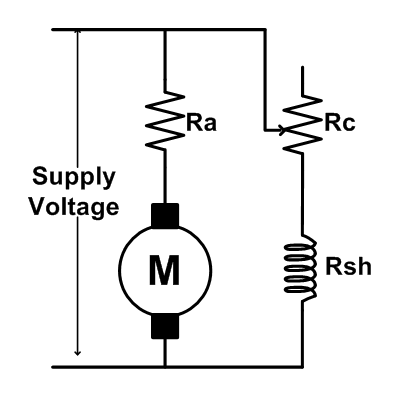
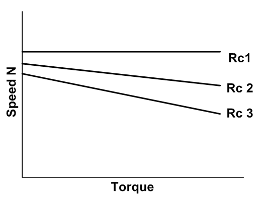

We know that the speed of shunt motor is given by: 

<b>N = (V-IaRa)/kФ </b>

Where, Va is the voltage applied across the armature and φ is the flux per pole and is proportional to the field current If.. As explained earlier, armature current Ia is decided by the mechanical load present on the shaft. Therefore, by varying Va and If we can vary n. For fixed supply voltage and the motor connected as shunt we can vary Va by controlling an external resistance connected in series with the armature. If of course can be varied by controlling external field resistance Rf connected with the field circuit.  

Thus forshunt motor we have essentially two methods for controlling speed, namely by: 

1. Varying armature resistance. 
2. Varying field resistance.  

 <b>Figure: Equivalent circuit for field control of DC motor</b>

 

### Speed control by varying field current:

In this method field circuit resistance is varied to control the speed of a d.c shunt motor. Let us rewrite the basic equation to understand the method. 

<b>N = (V-IaRa)/kФ </b>

If we vary I f, flux φ will change, hence speed will vary. To change If an external resistance is connected in series with the field windings. The resistance is called the shunt field regulator the field coil produces rated flux when no external resistance is connected and rated voltage is applied across field coil. It should be understood that we can only decrease flux from its rated value by adding external resistance. Thus the speed of the motor will rise as we decrease the field current and speed control above the base speed will be achieved. Speed versus armature current characteristic is shown.  

 <b>
Figure: Torque speed characteristics of DC motors</b>

