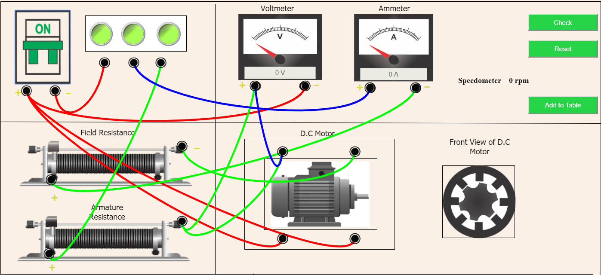

1. Connect  all  dots  in  the  following  manner: 
(a) A to K  
(b) A to Y  
(c)	A to J  
(d)	B to P  
(e)	E to M  	
(f)	F to D  
(g)	G to R  	
(h) H to I  
(i)	I to C  
(j)	C to H  
(k)	Q to L  

Then  Check  the  connections  by  clicking  on  Check  Button.  

  

3. If it shows alert "Incorrect Corrections" then press reset button and make connection again. 
4. If it shows alert"Correct Connections" then Turn On the MCB. 
5. Then set the Voltmeter first with the help of the second slider. 
6. Now,move the first slider to get corresponding values of Ammeter and Speedometer. 
7. Press the "Add to table" button to insert the values in table. 
8. After inserting values on table click on "Plot graph" to get your required graph. 